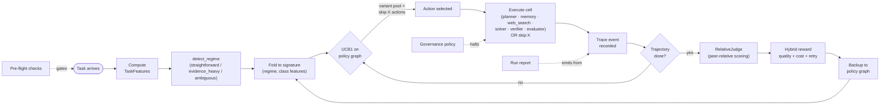

# AgensFlow
## A coordination-policy substrate for multi-agent systems.

**AgensFlow is a framework for coordinating multi-agent systems where coordination itself is the learnable object.**

The name combines Latin *agēns*, meaning acting, driving, or conducting, with *flow*: the framework is concerned not with a single static agent, but with agency in motion, structured through reusable coordination decisions. AgensFlow makes use-case-conditioned skill selection, model-role assignment, topology choice, and reward audit observable and learnable from repeated trajectories, rather than fixing them as one-off pipeline decisions.

AgensFlow treats orchestration as a first-class learnable object:

- **Structured handoffs** as the search state, not free-form transcripts.
- **Regime-conditioned activation** — the system detects what kind of task it faces and assembles the right coalition of specialists for that regime.
- **Folded policy graph** so repeated handoff configurations collapse to the same orchestration node, making search reusable and inspectable.

Variance is preserved where it is epistemically productive, removed where it is wasteful. The result: fewer tokens per successful task at the same reliability target.

## Status

Alpha. Layers 0–5 are shipping (policy primitives, runtime, learning substrate, reward + RelativeJudge, governance + pre-flight + reports). End-to-end experiments under [`experiments/`](experiments/) show how the substrate accumulates per-`(signature, action)` value across runs. Trace metrics, training pipelines, and the accompanying paper are part of the broader research program and will be released as the work matures.

## Quickstart

### Prerequisites — API keys

The framework calls external services. Set these environment variables (or put them in a local `.env` file at the repo root — `python-dotenv` is loaded automatically):

| variable | required | purpose |
|---|---|---|
| `OPENROUTER_API_KEY` | **always** | All LLM calls (agents, judges, planner, solver, verifier, evaluator) go through OpenRouter |
| `EXA_API_KEY` | when `web_search_exa` is in the activation plan | Exa neural search tool |
| `TAVILY_API_KEY` | when `web_search_tavily` is in the activation plan | Tavily web search tool |

Pre-flight checks (`preflight.default_checks` in your YAML) validate these at the start of every run — broken keys, exhausted quota, or rate-limit-down providers are caught **before** any LLM tokens are spent. Approximate cost in current experiments: ~$0.02 per pre-flight invocation.

### Install

```bash
git clone https://github.com/Nicolepcx/AgensFlow.git
cd AgensFlow
pip install -e ".[viz]"
```

### Plan a run (no LLM cost)

```python
from agensflow import (
    TaskFeatures, detect_regime, make_activation_plan, instantiate_branches,
)

features = TaskFeatures(
    requires_factual_grounding=True,
    ambiguity_level=0.3,
    contradiction_risk=0.2,
    evidence_availability=0.8,
    verification_need=0.7,
)

plan = make_activation_plan(features)
print(plan.regime.label)        # "evidence_heavy"
print(plan.selected_skills)     # ["planner", "memory", "solver", "verifier", "evaluator"]
print(plan.merge_strategy)      # "verifier_gate"
```

### Execute end-to-end with the learning runtime

```python
from agensflow.config import load_config
from agensflow.runtime.preflight import run_preflight_checks
from agensflow.runtime.client import OpenRouterClient
from agensflow.runtime.trace import TraceCollector
from agensflow.runtime.governance import GovernanceState, bind_governance_to_trace
from agensflow.learning.policy_graph import PolicyGraph
from agensflow.learning.persistence import load_policy_graph, save_policy_graph

# 1. Pre-flight: catch broken keys / quotas before LLM tokens are spent.
cfg = load_config("my-experiment.yaml")     # YAML overrides + defaults
result = run_preflight_checks(config=cfg.preflight)
if not result.all_passed:
    print(result.format_report()); raise SystemExit(1)

# 2. Wire the substrate.
client = OpenRouterClient()
trace = TraceCollector()
state = GovernanceState(policy=cfg.governance)
bind_governance_to_trace(trace, state)       # halt on infrastructure failure
graph = load_policy_graph("./graphs/policy.pkl")  # warm-start across runs

# 3. Run. Coordination decisions consult the learned graph; the rule-based
#    prior is the fallback. Every run contributes its outcome back via backup.
# (See examples/ and experiments/e03_production_traffic/ for full harnesses.)

# 4. Persist so learning compounds.
save_policy_graph(graph, "./graphs/policy.pkl")
```

### Configure via YAML

```yaml
# my-experiment.yaml
governance:
  max_consecutive_failures_per_agent: 3
  halt_on_terminal_errors: true

policy_graph:
  confidence_threshold: 10
  reliability_weight: 1.0    # safety-critical workload

reward:
  ruler_weight: 1.5
  cost_weight: 0.3

router:
  enable_skip: true          # let the policy learn coordination *choice*
```

Every knob that controls runtime behavior is YAML-overridable. The
loader catches typos at load time (strict mode by default). See
[`src/agensflow/configs/README.md`](src/agensflow/configs/README.md) for
the full configuration system.

## Architecture

AgensFlow is built in **six layers**, each independently useful:

| layer | what it does |
|---|---|
| **5** — pre-flight + governance + reports | Catch broken infrastructure before LLM cost; halt runs on policy violation; emit structured artifacts |
| **4** — reward + RelativeJudge | Compute the signal that flows into value estimates: rubric-anchored quality + operational penalties |
| **3** — policy graph + router + LangGraph integration | Folded `(signature, action)` value table; UCB selection; pure-function routing; LangGraph dispatch |
| **2** — agents + transport + trace | OpenRouter + Instructor-typed I/O; per-skill model bindings; in-memory event accumulation |
| **1** — schema + regimes + skill registry | Structured handoffs; regime detection; activation planning; skill cards |
| **0** — web search wrappers | First-class tool actions (Exa, Tavily) with retry/backoff/clamp |

For the full layer-by-layer architecture, dependency diagram, and
cross-cutting concerns, see [`docs/architecture.md`](docs/architecture.md).

### Runtime data flow



The substrate runs from left to right per task; the only loop is UCB1 consulting the graph at each routing step and backing up the reward at the end. Pre-flight, governance, and reports are cross-cutting (dashed lines) — they observe the trace and gate execution but aren't on the inner loop.

> **A note on `RelativeJudge` (layer 4).** This is the framework's
> custom peer-relative scoring method: an LLM judge sees N
> trajectories produced for the same task and ranks them relative to
> each other against an explicit rubric. The method is *inspired by* the 
> external [RULER](https://github.com/OpenPipe/ART) framework, but it is a 
> separate implementation with cross-judge averaging, per-axis
> decomposition, and disagreement-derived confidence weighting on top. 

For per-module knobs and design notes, see each module's `README.md`:

| layer | module |
|---|---|
| 0 | [`runtime/web_search`](src/agensflow/runtime/web_search/README.md) |
| 2 | [`runtime/client`](src/agensflow/runtime/client/README.md) · [`runtime/agents`](src/agensflow/runtime/agents/README.md) · [`runtime/models`](src/agensflow/runtime/models/README.md) · [`runtime/trace`](src/agensflow/runtime/trace/README.md) |
| 3 | [`learning/policy_graph`](src/agensflow/learning/policy_graph/README.md) · [`learning/router`](src/agensflow/learning/router/README.md) · [`runtime/graph`](src/agensflow/runtime/graph/README.md) |
| 4 | [`learning/relative_judge`](src/agensflow/learning/relative_judge/README.md) · [`learning/reward`](src/agensflow/learning/reward/README.md) · [`learning/persistence`](src/agensflow/learning/persistence/README.md) |
| 5 | [`runtime/preflight`](src/agensflow/runtime/preflight/README.md) · [`runtime/governance`](src/agensflow/runtime/governance/README.md) · [`runtime/report`](src/agensflow/runtime/report/README.md) |
| ✱ | [`config`](src/agensflow/configs/README.md) — YAML configuration system |


## Judge model compatibility

RelativeJudge supports both Instructor TOOLS mode and JSON mode, depending on the model provider. Some OpenRouter models support structured tool calls directly, while others require JSON-mode dispatch. See [`src/agensflow/learning/relative_judge/README.md`](src/agensflow/learning/relative_judge/README.md) for the current compatibility table, probe scripts, and validated cross-family judge configurations.


## Substrate optimization vs measurement audit

The substrate's UCB1 during a run uses **single-judge** reward as the optimization signal — that's correct experimental design (reward must stay fixed during a learning run). Cross-judge audit is a **post-hoc measurement** pass that re-scores completed trajectories under an ensemble. Even with RULER's relative-ranking design, our e09 audit found ~+0.04 of systematic bias on the single-judge headline — see `experiments/e09_cross_domain_security/RESULTS.md` for the worked example. Production deployments wanting bias-mitigated *live* reward can set `cross_judge_models` to run UCB against the ensemble at 3× judge cost; the framework supports it without code changes.


## License

Apache 2.0. See [LICENSE](LICENSE).

## Citation

The accompanying paper is available on arXiv:

Koenigstein, N. (2026). *AgensFlow: A Coordination-Policy Substrate for Multi-Agent Systems*. arXiv:2605.27466.

```bibtex
@misc{koenigstein2026agensflow,
  title={AgensFlow: A Coordination-Policy Substrate for Multi-Agent Systems},
  author={Koenigstein, Nicole},
  year={2026},
  eprint={2605.27466},
  archivePrefix={arXiv},
  primaryClass={cs.MA},
  url={https://arxiv.org/abs/2605.27466}
}

## Status of this work

AgensFlow is part of an ongoing research program on coordination policy for multi-agent systems.
